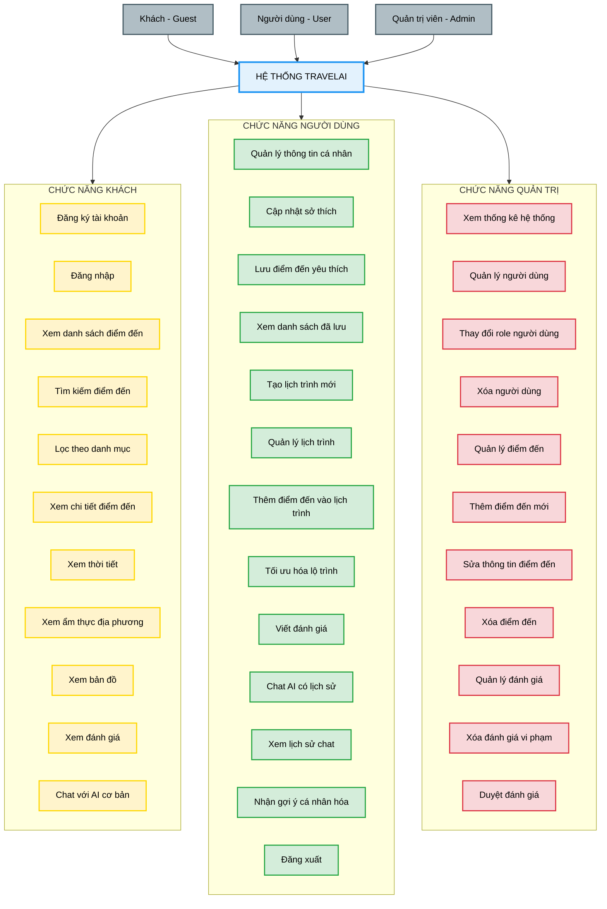
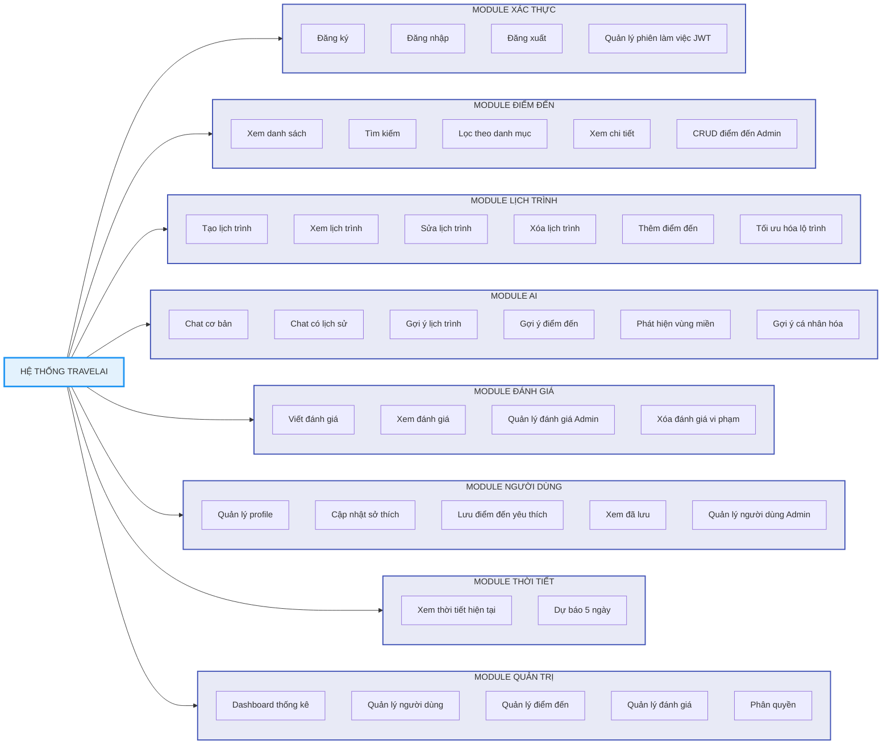
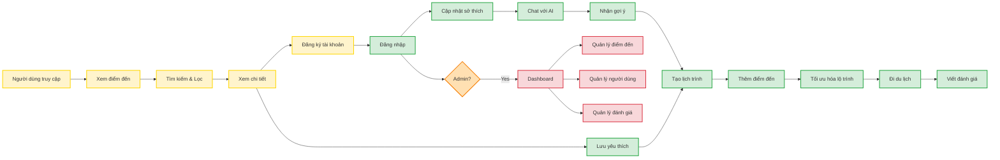

# SƠ ĐỒ CHỨC NĂNG HỆ THỐNG TRAVELAI

## Sơ đồ tổng quan

---

## Sơ đồ chi tiết theo module

---

## Sơ đồ phân cấp chức năng

```mermaid
graph TD
    Root[HỆ THỐNG TRAVELAI]
    
    %% Level 1
    Root --> Auth[Xác thực & Phân quyền]
    Root --> Dest[Quản lý Điểm đến]
    Root --> Itin[Quản lý Lịch trình]
    Root --> AI[Trí tuệ nhân tạo]
    Root --> Review[Đánh giá & Nhận xét]
    Root --> Admin[Quản trị hệ thống]
    
    %% Level 2 - Auth
    Auth --> Auth1[Đăng ký]
    Auth --> Auth2[Đăng nhập]
    Auth --> Auth3[JWT Token]
    
    %% Level 2 - Destination
    Dest --> Dest1[Xem & Tìm kiếm]
    Dest --> Dest2[Chi tiết điểm đến]
    Dest --> Dest3[Lưu yêu thích]
    Dest --> Dest4[CRUD Admin]
    
    %% Level 3 - Destination Detail
    Dest2 --> Dest2a[Thông tin cơ bản]
    Dest2 --> Dest2b[Thời tiết]
    Dest2 --> Dest2c[Ẩm thực]
    Dest2 --> Dest2d[Bản đồ]
    Dest2 --> Dest2e[Đánh giá]
    
    %% Level 2 - Itinerary
    Itin --> Itin1[Tạo lịch trình]
    Itin --> Itin2[Quản lý lịch trình]
    Itin --> Itin3[Tối ưu hóa]
    
    %% Level 3 - Itinerary Management
    Itin2 --> Itin2a[Xem danh sách]
    Itin2 --> Itin2b[Chỉnh sửa]
    Itin2 --> Itin2c[Xóa]
    Itin2 --> Itin2d[Thêm điểm đến]
    
    %% Level 2 - AI
    AI --> AI1[Chatbot]
    AI --> AI2[Gợi ý thông minh]
    AI --> AI3[Phân tích vùng miền]
    
    %% Level 3 - AI Chatbot
    AI1 --> AI1a[Chat cơ bản]
    AI1 --> AI1b[Chat có lịch sử]
    AI1 --> AI1c[Lịch sử chat]
    
    %% Level 3 - AI Recommendation
    AI2 --> AI2a[Gợi ý điểm đến]
    AI2 --> AI2b[Gợi ý lịch trình]
    AI2 --> AI2c[Cá nhân hóa]
    
    %% Level 2 - Review
    Review --> Rev1[Viết đánh giá]
    Review --> Rev2[Xem đánh giá]
    Review --> Rev3[Kiểm duyệt Admin]
    
    %% Level 2 - Admin
    Admin --> Admin1[Thống kê]
    Admin --> Admin2[Quản lý User]
    Admin --> Admin3[Quản lý Destination]
    Admin --> Admin4[Quản lý Review]
    
    %% Styling
    classDef level1 fill:#BBDEFB,stroke:#1976D2,stroke-width:3px
    classDef level2 fill:#C8E6C9,stroke:#388E3C,stroke-width:2px
    classDef level3 fill:#FFF9C4,stroke:#F57C00,stroke-width:2px
    classDef root fill:#E1BEE7,stroke:#7B1FA2,stroke-width:4px
    
    class Root root
    class Auth,Dest,Itin,AI,Review,Admin level1
    class Auth1,Auth2,Auth3,Dest1,Dest2,Dest3,Dest4,Itin1,Itin2,Itin3,AI1,AI2,AI3,Rev1,Rev2,Rev3,Admin1,Admin2,Admin3,Admin4 level2
    class Dest2a,Dest2b,Dest2c,Dest2d,Dest2e,Itin2a,Itin2b,Itin2c,Itin2d,AI1a,AI1b,AI1c,AI2a,AI2b,AI2c level3
```

---

## Sơ đồ luồng chức năng chính

---

## Sơ đồ chức năng theo API Endpoints

```mermaid
graph TB
    API[API ENDPOINTS]
    
    %% Auth APIs
    subgraph AuthAPI["🔐 /api/auth"]
        AuthAPI1[POST /register]
        AuthAPI2[POST /login]
    end
    
    %% User APIs
    subgraph UserAPI["👤 /api/users"]
        UserAPI1[GET /profile]
        UserAPI2[PUT /profile]
        UserAPI3[GET /:id]
    end
    
    %% Destination APIs
    subgraph DestAPI["🏝️ /api/destinations"]
        DestAPI1[GET /]
        DestAPI2[GET /:id]
        DestAPI3[POST /]
        DestAPI4[PUT /:id]
        DestAPI5[DELETE /:id]
    end
    
    %% Itinerary APIs
    subgraph ItinAPI["📅 /api/itineraries"]
        ItinAPI1[GET /]
        ItinAPI2[POST /]
        ItinAPI3[GET /:id]
        ItinAPI4[PUT /:id]
        ItinAPI5[DELETE /:id]
        ItinAPI6[POST /:id/destinations]
    end
    
    %% AI APIs
    subgraph AIAPI["🤖 /api/ai"]
        AIAPI1[POST /chat]
        AIAPI2[POST /chat-with-history]
        AIAPI3[GET /history]
        AIAPI4[DELETE /history]
    end
    
    %% Review APIs
    subgraph ReviewAPI["⭐ /api/reviews"]
        ReviewAPI1[GET /destination/:id]
        ReviewAPI2[POST /]
        ReviewAPI3[GET /my]
    end
    
    %% Saved APIs
    subgraph SavedAPI["❤️ /api/saved"]
        SavedAPI1[GET /]
        SavedAPI2[POST /:id]
        SavedAPI3[GET /check/:id]
    end
    
    %% Weather APIs
    subgraph WeatherAPI["🌤️ /api/weather"]
        WeatherAPI1[GET /current]
        WeatherAPI2[GET /forecast]
    end
    
    %% Recommendation APIs
    subgraph RecAPI["🎯 /api/recommendations"]
        RecAPI1[GET /personalized]
        RecAPI2[GET /trending]
    end
    
    %% Admin APIs
    subgraph AdminAPI["⚙️ /api/admin"]
        AdminAPI1[GET /stats]
        AdminAPI2[GET /users]
        AdminAPI3[PUT /users/:id/role]
        AdminAPI4[DELETE /users/:id]
        AdminAPI5[GET /reviews]
        AdminAPI6[DELETE /reviews/:id]
    end
    
    %% Connections
    API --> AuthAPI
    API --> UserAPI
    API --> DestAPI
    API --> ItinAPI
    API --> AIAPI
    API --> ReviewAPI
    API --> SavedAPI
    API --> WeatherAPI
    API --> RecAPI
    API --> AdminAPI
    
    %% Styling
    classDef apiStyle fill:#E8F5E9,stroke:#4CAF50,stroke-width:2px
    classDef mainStyle fill:#E3F2FD,stroke:#2196F3,stroke-width:3px
    
    class AuthAPI1,AuthAPI2,UserAPI1,UserAPI2,UserAPI3,DestAPI1,DestAPI2,DestAPI3,DestAPI4,DestAPI5,ItinAPI1,ItinAPI2,ItinAPI3,ItinAPI4,ItinAPI5,ItinAPI6,AIAPI1,AIAPI2,AIAPI3,AIAPI4,ReviewAPI1,ReviewAPI2,ReviewAPI3,SavedAPI1,SavedAPI2,SavedAPI3,WeatherAPI1,WeatherAPI2,RecAPI1,RecAPI2,AdminAPI1,AdminAPI2,AdminAPI3,AdminAPI4,AdminAPI5,AdminAPI6 apiStyle
    class API mainStyle
```

---

## Hướng dẫn sử dụng

### Xem trực tiếp:
1. Copy mã Mermaid
2. Vào: https://mermaid.live/
3. Paste và xem kết quả

### Export hình ảnh:
1. Trên Mermaid Live, click **Actions** → **Export PNG/SVG**
2. Lưu hình và chèn vào Word

### Chỉnh sửa:
- Thay đổi màu sắc: Sửa trong phần `classDef`
- Thêm/bớt chức năng: Thêm node mới và kết nối
- Thay đổi layout: Đổi `graph TB` (top-bottom) thành `graph LR` (left-right)

---

*Tài liệu được tạo cho hệ thống TravelAI*
