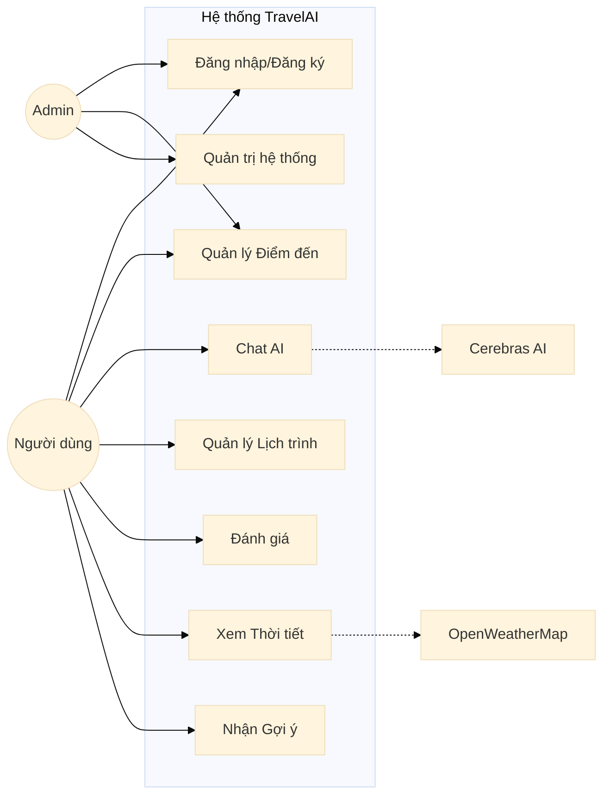

# Sơ Đồ Use Case - Hệ Thống TravelAI

## Mã Mermaid cho Use Case Diagram

```mermaid
graph TB
    %% Actors
    User((Người dùng<br/>User))
    Admin((Quản trị viên<br/>Admin))
    AI[AI System<br/>Cerebras AI]
    Weather[Weather API<br/>OpenWeatherMap]
    
    %% Use Cases - Authentication
    subgraph Authentication["🔐 Xác thực"]
        UC1[Đăng ký tài khoản]
        UC2[Đăng nhập]
        UC3[Quản lý Profile]
    end
    
    %% Use Cases - Destination Management
    subgraph DestinationMgmt["🏝️ Quản lý Điểm đến"]
        UC4[Xem danh sách điểm đến]
        UC5[Tìm kiếm điểm đến]
        UC6[Xem chi tiết điểm đến]
        UC7[Lọc theo danh mục]
        UC8[Lưu điểm đến yêu thích]
        UC9[CRUD điểm đến]
    end
    
    %% Use Cases - AI Chat
    subgraph AIChat["🤖 Tư vấn AI"]
        UC10[Chat với AI]
        UC11[Nhận gợi ý lịch trình]
        UC12[Hỏi về điểm đến]
        UC13[Tư vấn ẩm thực]
        UC14[Xem lịch sử chat]
    end
    
    %% Use Cases - Itinerary
    subgraph Itinerary["📅 Quản lý Lịch trình"]
        UC15[Tạo lịch trình mới]
        UC16[Xem lịch trình]
        UC17[Chỉnh sửa lịch trình]
        UC18[Xóa lịch trình]
        UC19[Thêm điểm đến vào lịch trình]
        UC20[Tối ưu hóa lộ trình]
    end
    
    %% Use Cases - Review
    subgraph Review["⭐ Đánh giá"]
        UC21[Viết đánh giá]
        UC22[Xem đánh giá]
        UC23[Xóa đánh giá không phù hợp]
    end
    
    %% Use Cases - Weather
    subgraph WeatherInfo["🌤️ Thông tin Thời tiết"]
        UC24[Xem thời tiết hiện tại]
        UC25[Xem dự báo 5 ngày]
    end
    
    %% Use Cases - Recommendations
    subgraph Recommendations["🎯 Gợi ý"]
        UC26[Nhận gợi ý cá nhân hóa]
        UC27[Xem điểm đến trending]
        UC28[Làm quiz sở thích]
    end
    
    %% Use Cases - Admin
    subgraph AdminPanel["⚙️ Quản trị hệ thống"]
        UC29[Quản lý người dùng]
        UC30[Xem thống kê]
        UC31[Quản lý đánh giá]
        UC32[Phân quyền user]
    end
    
    %% User connections
    User --> UC1
    User --> UC2
    User --> UC3
    User --> UC4
    User --> UC5
    User --> UC6
    User --> UC7
    User --> UC8
    User --> UC10
    User --> UC11
    User --> UC12
    User --> UC13
    User --> UC14
    User --> UC15
    User --> UC16
    User --> UC17
    User --> UC18
    User --> UC19
    User --> UC20
    User --> UC21
    User --> UC22
    User --> UC24
    User --> UC25
    User --> UC26
    User --> UC27
    User --> UC28
    
    %% Admin connections (Admin kế thừa User)
    Admin --> UC9
    Admin --> UC23
    Admin --> UC29
    Admin --> UC30
    Admin --> UC31
    Admin --> UC32
    Admin --> UC1
    Admin --> UC2
    Admin --> UC3
    Admin --> UC4
    Admin --> UC5
    Admin --> UC6
    
    %% AI System connections
    UC10 -.->|sử dụng| AI
    UC11 -.->|sử dụng| AI
    UC12 -.->|sử dụng| AI
    UC13 -.->|sử dụng| AI
    UC26 -.->|sử dụng| AI
    
    %% Weather API connections
    UC24 -.->|gọi API| Weather
    UC25 -.->|gọi API| Weather
    
    %% Include relationships
    UC11 -.->|include| UC15
    UC28 -.->|include| UC10
    UC20 -.->|include| UC19
    
    %% Extend relationships
    UC5 -.->|extend| UC4
    UC7 -.->|extend| UC4
    UC8 -.->|extend| UC6
    
    %% Styling
    classDef userClass fill:#4A90E2,stroke:#2E5C8A,stroke-width:3px,color:#fff
    classDef adminClass fill:#E24A4A,stroke:#8A2E2E,stroke-width:3px,color:#fff
    classDef systemClass fill:#50C878,stroke:#2E8A57,stroke-width:2px,color:#fff
    
    class User userClass
    class Admin adminClass
    class AI,Weather systemClass
```

---

## Phiên bản đơn giản hơn (cho Draw.io)

---

## Chi tiết Use Cases

### 👤 **Người dùng (User)**

| Use Case | Mô tả | API Endpoint |
|----------|-------|--------------|
| **UC1: Đăng ký tài khoản** | Tạo tài khoản mới với email, password | POST /api/auth/register |
| **UC2: Đăng nhập** | Đăng nhập bằng email/password, nhận JWT token | POST /api/auth/login |
| **UC3: Quản lý Profile** | Xem và cập nhật thông tin cá nhân, sở thích | GET/PUT /api/users/profile |
| **UC4: Xem danh sách điểm đến** | Xem tất cả điểm đến du lịch | GET /api/destinations |
| **UC5: Tìm kiếm điểm đến** | Tìm kiếm theo tên, địa điểm | GET /api/destinations?search=... |
| **UC6: Xem chi tiết điểm đến** | Xem thông tin chi tiết, hình ảnh, đánh giá | GET /api/destinations/:id |
| **UC7: Lọc theo danh mục** | Lọc theo beach, mountain, city, heritage | GET /api/destinations?category=... |
| **UC8: Lưu điểm đến yêu thích** | Lưu/bỏ lưu điểm đến | POST /api/saved/:id |
| **UC10: Chat với AI** | Hỏi đáp với AI về du lịch | POST /api/ai/chat |
| **UC11: Nhận gợi ý lịch trình** | AI tạo lịch trình tự động | POST /api/ai/suggest-itinerary |
| **UC12: Hỏi về điểm đến** | Hỏi thông tin cụ thể về điểm đến | POST /api/ai/askDestination |
| **UC13: Tư vấn ẩm thực** | Hỏi về món ăn, đặc sản địa phương | POST /api/ai/chat |
| **UC14: Xem lịch sử chat** | Xem các cuộc trò chuyện trước đó | GET /api/ai/history |
| **UC15: Tạo lịch trình mới** | Tạo kế hoạch du lịch mới | POST /api/itineraries |
| **UC16: Xem lịch trình** | Xem danh sách lịch trình đã tạo | GET /api/itineraries |
| **UC17: Chỉnh sửa lịch trình** | Cập nhật thông tin lịch trình | PUT /api/itineraries/:id |
| **UC18: Xóa lịch trình** | Xóa lịch trình không cần thiết | DELETE /api/itineraries/:id |
| **UC19: Thêm điểm đến vào lịch trình** | Thêm địa điểm vào kế hoạch | POST /api/itineraries/:id/destinations |
| **UC20: Tối ưu hóa lộ trình** | Sắp xếp điểm đến theo khoảng cách gần nhất | Thuật toán Nearest Neighbor |
| **UC21: Viết đánh giá** | Đánh giá và nhận xét điểm đến | POST /api/reviews |
| **UC22: Xem đánh giá** | Xem đánh giá của người khác | GET /api/reviews/destination/:id |
| **UC24: Xem thời tiết hiện tại** | Xem thời tiết của điểm đến | GET /api/weather/current |
| **UC25: Xem dự báo 5 ngày** | Xem dự báo thời tiết | GET /api/weather/forecast |
| **UC26: Nhận gợi ý cá nhân hóa** | Gợi ý dựa trên sở thích | GET /api/recommendations |
| **UC27: Xem điểm đến trending** | Xem điểm đến phổ biến | GET /api/recommendations/trending |
| **UC28: Làm quiz sở thích** | Trả lời 5 câu hỏi để AI hiểu sở thích | Frontend: SmartSuggestion.tsx |

### 👨‍💼 **Quản trị viên (Admin)**

| Use Case | Mô tả | API Endpoint |
|----------|-------|--------------|
| **UC9: CRUD điểm đến** | Thêm, sửa, xóa điểm đến | POST/PUT/DELETE /api/destinations |
| **UC23: Xóa đánh giá không phù hợp** | Kiểm duyệt và xóa đánh giá vi phạm | DELETE /api/admin/reviews/:id |
| **UC29: Quản lý người dùng** | Xem, xóa, chặn người dùng | GET/DELETE /api/admin/users |
| **UC30: Xem thống kê** | Xem số liệu tổng quan hệ thống | GET /api/admin/stats |
| **UC31: Quản lý đánh giá** | Xem tất cả đánh giá | GET /api/admin/reviews |
| **UC32: Phân quyền user** | Đổi role user/admin | PUT /api/admin/users/:id/role |

### 🤖 **Hệ thống bên ngoài**

| System | Mô tả | API |
|--------|-------|-----|
| **Cerebras AI** | Chatbot AI (Llama 3.1-8B) | NVIDIA API |
| **OpenWeatherMap** | Thông tin thời tiết | Weather API |
| **OpenStreetMap** | Hiển thị bản đồ | Leaflet |

---

## Mối quan hệ giữa các Use Cases

### **Include** (bao gồm - bắt buộc)
- UC11 (Nhận gợi ý lịch trình) **include** UC15 (Tạo lịch trình mới)
- UC28 (Làm quiz sở thích) **include** UC10 (Chat với AI)
- UC20 (Tối ưu hóa lộ trình) **include** UC19 (Thêm điểm đến)

### **Extend** (mở rộng - tùy chọn)
- UC5 (Tìm kiếm) **extend** UC4 (Xem danh sách)
- UC7 (Lọc theo danh mục) **extend** UC4 (Xem danh sách)
- UC8 (Lưu yêu thích) **extend** UC6 (Xem chi tiết)

### **Generalization** (kế thừa)
- Admin **kế thừa** User (Admin có tất cả quyền của User + quyền quản trị)

---

## Hướng dẫn sử dụng với Draw.io

### Cách 1: Import trực tiếp Mermaid
1. Mở Draw.io (https://app.diagrams.net/)
2. Chọn **Arrange** → **Insert** → **Advanced** → **Mermaid**
3. Paste mã Mermaid vào
4. Click **Insert**

### Cách 2: Vẽ thủ công
1. Sử dụng shape **Actor** (hình người) cho User và Admin
2. Sử dụng **Ellipse** (hình oval) cho Use Cases
3. Sử dụng **Rectangle** để nhóm Use Cases (System boundary)
4. Sử dụng **Line** để kết nối:
   - Solid line (─): Association (User → Use Case)
   - Dashed arrow (-->): Include/Extend
   - Hollow arrow (▷): Generalization

### Cách 3: Export từ Mermaid Live Editor
1. Truy cập https://mermaid.live/
2. Paste mã Mermaid
3. Click **Actions** → **Export SVG/PNG**
4. Import file vào Draw.io

---

## Lưu ý

- Sơ đồ này mô tả **tất cả chức năng chính** của hệ thống TravelAI
- Mỗi Use Case tương ứng với **1 hoặc nhiều API endpoints**
- Admin có **tất cả quyền của User** + quyền quản trị
- AI và Weather API là **hệ thống bên ngoài** (external actors)
- Sơ đồ tuân thủ chuẩn **UML Use Case Diagram**

---

*Tài liệu được tạo tự động từ dự án TravelAI*
